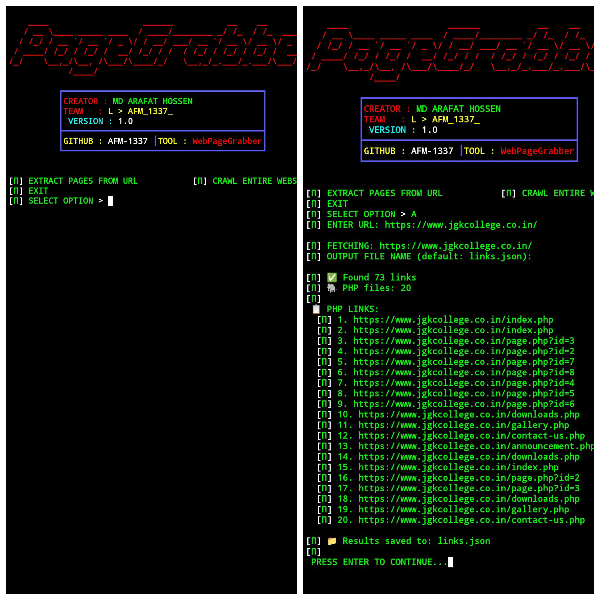

```markdown
# 🕸️ PageGrabber

[](https://github.com/AFM-1337/PageGrabber)
[](https://www.python.org/)
[](LICENSE)

**PageGrabber** is a powerful web link extraction tool designed for security researchers and penetration testers. It crawls websites to discover PHP pages, JavaScript files, CSS, images, and external/internal links – essential for identifying potential SQL injection points and understanding the attack surface.

> ⚠️ **Disclaimer**: This tool is for **LEGITIMATE security testing and educational purposes only**. Use only on websites you own or have explicit permission to test.

## ✨ Features

- 🐘 **PHP Link Discovery** – Identify PHP files and endpoints (prime targets for SQLi testing)
- 📜 **JavaScript & CSS Extraction** – Find front-end resources and hidden scripts
- 🖼️ **Image Link Grabbing** – Discover all media assets
- 🌐 **Internal & External Links** – Map site structure and outbound connections
- 🚀 **Full Site Crawling** – Configurable depth and page limits
- ⚡ **Single Page Mode** – Quick analysis without crawling
- 📁 **JSON Output** – Save results for further processing or reporting
- 🎨 **Colorful Terminal UI** – Clear, readable output

## 📸 Screenshot



## 🔧 Installation

```bash
# Clone the repository
git clone https://github.com/AFM-1337/PageGrabber.git
cd PageGrabber

# Install required dependencies
pip install requests
```

🚀 Usage

Interactive Mode

Simply run the script without arguments to enter the interactive menu:

```bash
python pagegrabber.py
```

You'll be presented with:

1. Extract from single URL – Quick link extraction from one page
2. Crawl entire website – Deep crawling with configurable depth
3. Exit – Quit the tool

Command Line Mode

Single Page Mode

```bash
python pagegrabber.py -u https://target.com -o output.json --no-crawl
```

Full Crawl Mode

```bash
python pagegrabber.py -u https://target.com -o crawl_results.json -m 100 -d 3
```

Command Line Arguments

Argument Description Default
-u, --url Target URL Required
-o, --output Output file name links.json
-m, --max-pages Maximum pages to crawl 50
-d, --depth Crawl depth (levels from start) 3
--no-crawl Single page mode (no crawling) False

📊 Output Example

Results are saved in JSON format:

```json
{
  "total_pages": 45,
  "total_links": 342,
  "php_links": [
    "https://target.com/index.php",
    "https://target.com/login.php"
  ],
  "js_links": [...],
  "css_links": [...],
  "image_links": [...],
  "internal_links": [...],
  "external_links": [...]
}
```

🎯 Use Cases

· Security Assessments – Map attack surface before penetration testing
· SQL Injection Testing – Identify PHP endpoints for further testing
· Bug Bounty Hunting – Discover hidden directories and files
· Site Mapping – Understand website structure for documentation
· Resource Discovery – Find all external resources used by a site

🛠️ How It Works

1. Fetch – Requests pages with a realistic User-Agent
2. Parse – Extracts all href and src attributes
3. Classify – Sorts links by type (PHP, JS, CSS, images, etc.)
4. Crawl – Follows internal links up to specified depth
5. Save – Exports results to JSON for analysis

⚙️ Requirements

· Python 3.6+
· requests library

📁 Repository Structure

```
PageGrabber/
├── pagegrabber.py          # Main script
├── README.md               # This file
├── LICENSE                 # MIT License
└── Picsart_26-03-22_22-21-11-701.jpg  # Screenshot
```

⚠️ Important Notes

· Be Respectful: The script includes a 0.5-second delay between requests to avoid overloading servers.
· Legal Use Only: Unauthorized scanning of websites may violate laws and terms of service.
· Rate Limiting: Adjust time.sleep() value if needed.

🔒 License

This project is licensed under the MIT License – see the LICENSE file for details.

👤 Author

MD ARAFAT HOSSEN

· GitHub: @AFM-1337
· Team: L > AFM_1337_

🙌 Contributing

Contributions, issues, and feature requests are welcome! Feel free to check the issues page.

---

Happy Hunting! 🎯

```

This README provides:
1. **Clear purpose** – Explains what the tool does and its legitimate use
2. **Installation & usage** – Step-by-step instructions with examples
3. **Feature highlights** – Showcases the key capabilities
4. **Legal disclaimer** – Important for security tools
5. **Visual structure** – Uses badges, emojis, and formatting for readability

You can add your actual screenshot filename if it differs from the one in the repository. Let me know if you'd like any adjustments!
